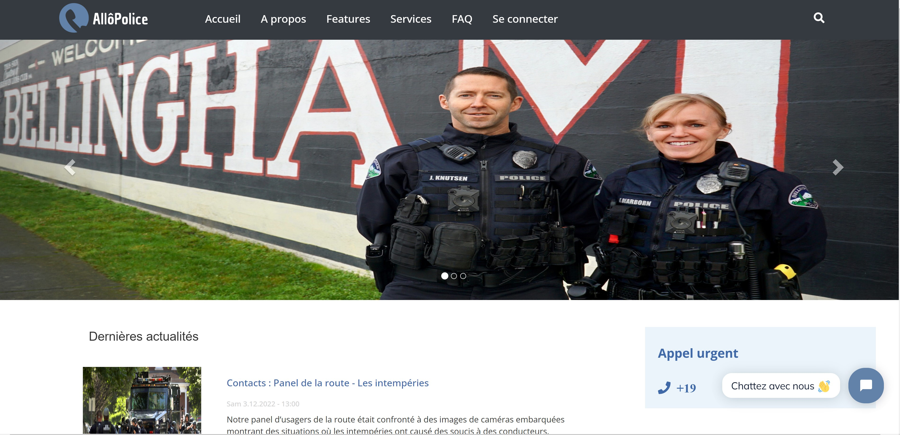

# PoliceOnWeb: A Platform for Police Service Management 

PoliceOnWeb is an innovative web application aimed at digitizing police services. It enhances communication between law enforcement and citizens by offering an interactive platform to file complaints, report incidents, view real-time safety alerts, and much more.

## Demo Video

*Click the image above to watch the application demo.*

## Project Description

PoliceOnWeb was designed to meet the growing needs of both citizens and law enforcement in a digital environment. The project is based on an in-depth study that identified the expected features and technical constraints of the system.

### Objectives

- **Digitization of police services**: Simplify complaint filing and incident reporting.
- **Effective communication**: Provide a platform for fast and secure exchanges between citizens and police.
- **Transparency and responsiveness**: Enable authorities to act quickly in emergencies while building public trust.

### Main Features

- **For the Administrator**:
  - Manage reports and respond to users.
  - View testimonies.
  - Manage wanted, missing, and unidentified persons.
  - Administer unclaimed property.
  - Update and display FAQs and visitor messages.
  - Visualize statistics on crimes and complaints.

- **For the User**:
  - File and track complaints.
  - Report missing persons.
  - Publish testimonies.
  - Manage personal profile and view interaction history.

- **For the Visitor**:
  - View news and local updates published by the admin.
  - Access frequently asked questions.
  - Interact with the admin via messaging.

### Technologies and Architecture

The project is based on a robust, modular architecture using the following technologies:

- **Back-end**:
  - **Java EE** for business logic and transaction management.
  - **Apache Tomcat** as the application server.
  - **MySQL** for database management.

- **Front-end**:
  - **HTML, CSS, and JavaScript** for a modern, responsive user interface.

- **Design Patterns**:
  - **MVC (Model-View-Controller)** to separate presentation and business logic.
  - **DAO (Data Access Object)** for data access and code modularity.

The software architecture is divided into several layers, ensuring a clear separation between presentation, business logic, and data access. Java packages are organized to manage business objects, data access (DAO), and servlets that bridge the front-end and back-end. The project structure is complemented by a well-organized set of web resources (images, scripts, styles) and dedicated interfaces for administration and users.

### Benefits and Challenges

- **Improved responsiveness**: Allows the police to respond quickly in emergency situations.
- **Accessibility**: Provides a solution accessible to all, including those unable to visit a police station.
- **Security and reliability**: Ensures secure communication and reliable data—essential for building trust between citizens and authorities.
- **Ease of use**: An intuitive interface for seamless navigation and access to services.

## 🙌 Contributions and Thanks

PoliceOnWeb is the result of collaborative effort and dedication to improving public safety through digital innovation. We truly appreciate your interest in this project!

If you find it useful, **feel free to give it a ⭐️** — it really helps!  
And don't hesitate to **fork** the repository and add your own improvements — contributions are always welcome!

